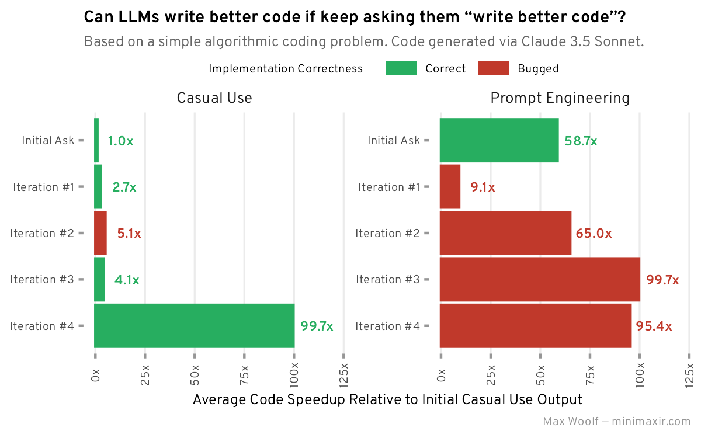

# llm-write-better-code

Conversation logs with Claude 3.5 Sonnet to try and iteratively optimize code, plus a benchmarking notebook and R code for data viz. This repo is a complement for [Can LLMs write better code if you keep asking them to “write better code”?](https://minimaxir.com/2025/01/write-better-code/).

## Maintainer/Creator

Max Woolf ([@minimaxir](https://minimaxir.com))

_Max's open-source projects are supported by his [Patreon](https://www.patreon.com/minimaxir) and [GitHub Sponsors](https://github.com/sponsors/minimaxir). If you found this project helpful, any monetary contributions to the Patreon are appreciated and will be put to good creative use._

## License

MIT
